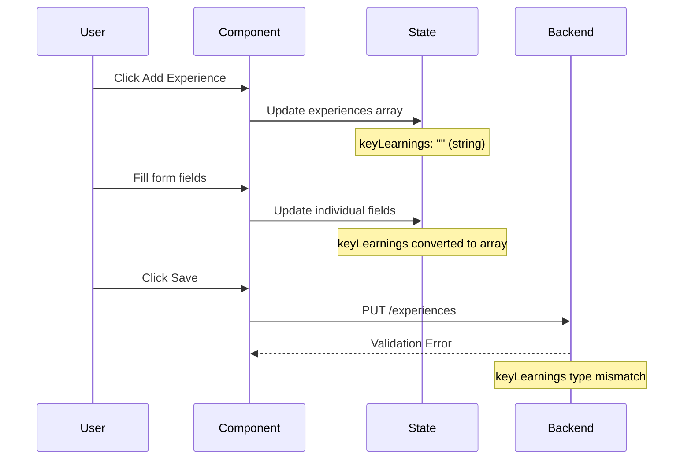
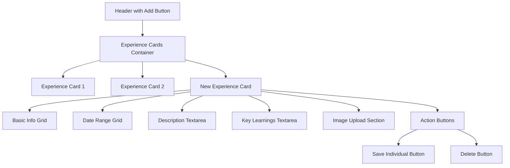
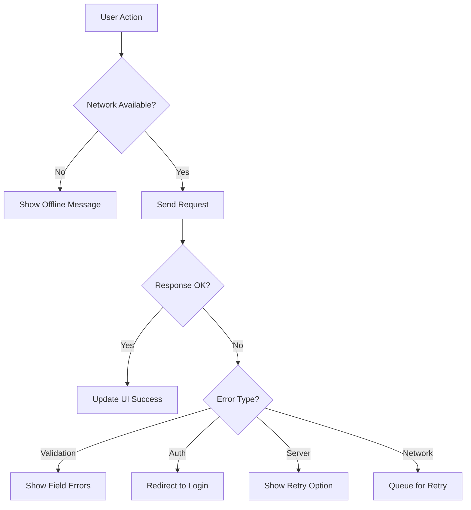

# Admin Panel Experience Fix - Design Document

## Overview

The admin panel's experience section has a non-functional "Add Experience" feature that prevents users from properly adding new work experience entries. This design addresses the root causes and provides comprehensive solutions to restore full functionality.

## Problem Analysis

### Current Issues Identified

1. **Data Type Mismatch**: The `keyLearnings` field has inconsistent handling between string and array formats
2. **Backend Validation**: Server-side validation requires mandatory fields that may not be immediately filled
3. **State Management**: Potential race conditions in React state updates
4. **User Experience**: No immediate visual feedback when adding experiences
5. **Form Persistence**: Added experiences may not persist due to validation failures

### Technical Root Causes

```mermaid
graph TD
    A[User Clicks Add Experience] --> B[addExperience() Function]
    B --> C[Updates experiences State]
    C --> D{Validation Check}
    D -->|Pass| E[Form Renders]
    D -->|Fail| F[Silent Failure]
    E --> G[User Fills Form]
    G --> H[saveData() Called]
    H --> I{Backend Validation}
    I -->|Pass| J[Data Saved]
    I -->|Fail| K[Error Display]
    F --> L[No Form Shown]
```

## Architecture Analysis

### Current Component Structure

| Component | Responsibility | Issues |
|-----------|---------------|---------|
| ExperienceAdmin | Main container, state management | Mixed data type handling |
| addExperience() | Adds new experience to state | Inconsistent keyLearnings format |
| updateExperience() | Updates experience fields | No validation feedback |
| saveData() | Persists to backend | Backend validation conflicts |

### Data Flow Issues



## Frontend Component Architecture

### State Management Improvements

```typescript
interface ExperienceData {
  title: string;
  company: string;
  location: string;
  startDate: string;
  endDate: string;
  description: string;
  image: string;
  keyLearnings: string[];  // Consistent array type
}

interface ComponentState {
  experiences: ExperienceData[];
  isSaving: boolean;
  isAdding: boolean;      // New loading state
  error: string;
  success: string;
  uploadingIndex: number | null;
  validationErrors: Record<number, string[]>; // Field-level validation
}
```

### Enhanced Add Experience Function

```typescript
const addExperience = () => {
  setIsAdding(true);
  const newExperience: ExperienceData = {
    title: "",
    company: "",
    location: "",
    startDate: "",
    endDate: "",
    description: "",
    image: "",
    keyLearnings: [] // Consistent array format
  };
  
  setExperiences(prev => [...prev, newExperience]);
  setIsAdding(false);
  
  // Auto-scroll to new experience form
  setTimeout(() => {
    const newIndex = experiences.length;
    scrollToExperience(newIndex);
  }, 100);
};
```

### Form Validation Layer

```typescript
const validateExperience = (exp: ExperienceData): string[] => {
  const errors: string[] = [];
  
  if (!exp.title?.trim()) errors.push("Job title is required");
  if (!exp.company?.trim()) errors.push("Company name is required");
  if (!exp.startDate?.trim()) errors.push("Start date is required");
  
  return errors;
};

const validateAllExperiences = (): boolean => {
  const newValidationErrors: Record<number, string[]> = {};
  let hasErrors = false;
  
  experiences.forEach((exp, index) => {
    const errors = validateExperience(exp);
    if (errors.length > 0) {
      newValidationErrors[index] = errors;
      hasErrors = true;
    }
  });
  
  setValidationErrors(newValidationErrors);
  return !hasErrors;
};
```

## Backend API Enhancements

### Improved Experience Endpoint

```javascript
app.put('/experiences', authenticate, async (req, res) => {
  try {
    const experiences = req.body;

    // Enhanced validation
    if (!Array.isArray(experiences)) {
      return res.status(400).json({ 
        error: 'Request body must be an array of experiences.',
        code: 'INVALID_FORMAT'
      });
    }

    // Validate each experience with detailed feedback
    const validationErrors = [];
    experiences.forEach((exp, index) => {
      const expErrors = [];
      
      if (!exp.title?.trim()) expErrors.push("title is required");
      if (!exp.company?.trim()) expErrors.push("company is required");
      if (!exp.startDate?.trim()) expErrors.push("startDate is required");
      
      // Handle keyLearnings conversion
      if (typeof exp.keyLearnings === 'string') {
        exp.keyLearnings = exp.keyLearnings
          .split('\n')
          .filter(item => item.trim())
          .map(item => item.trim());
      }
      
      if (expErrors.length > 0) {
        validationErrors.push({
          index,
          errors: expErrors
        });
      }
    });

    if (validationErrors.length > 0) {
      return res.status(400).json({
        error: 'Validation failed',
        code: 'VALIDATION_ERROR',
        details: validationErrors
      });
    }

    // Save to database
    await Experience.deleteMany({});
    const savedExperiences = await Experience.insertMany(experiences);
    
    res.json({ 
      success: true, 
      count: savedExperiences.length,
      message: `Successfully saved ${savedExperiences.length} experiences`
    });
    
  } catch (error) {
    console.error('Experience save error:', error);
    res.status(500).json({
      error: 'Internal server error',
      code: 'SERVER_ERROR'
    });
  }
});
```

### Database Schema Optimization

```javascript
const experienceSchema = new mongoose.Schema({
  title: { type: String, required: true, trim: true },
  company: { type: String, required: true, trim: true },
  location: { type: String, trim: true },
  startDate: { type: String, required: true },
  endDate: { type: String },
  description: { type: String, trim: true },
  image: { type: String },
  keyLearnings: [{ type: String, trim: true }],
  createdAt: { type: Date, default: Date.now },
  updatedAt: { type: Date, default: Date.now }
});

experienceSchema.pre('save', function(next) {
  this.updatedAt = new Date();
  next();
});
```

## User Interface Improvements

### Enhanced Form Layout



### Real-time Validation Display

| Field | Validation Rule | Error Message |
|-------|----------------|---------------|
| Title | Required, min 2 chars | "Job title is required and must be at least 2 characters" |
| Company | Required, min 2 chars | "Company name is required and must be at least 2 characters" |
| Start Date | Required, valid format | "Start date is required (e.g., 'January 2022')" |
| End Date | Optional, valid format | "End date format invalid (e.g., 'December 2023' or 'Present')" |
| Description | Optional, max 1000 chars | "Description must be less than 1000 characters" |

### Improved User Feedback

```typescript
const FeedbackSystem = {
  onAdd: "New experience added! Fill in the required fields below.",
  onSave: "Experience saved successfully!",
  onValidationError: "Please fix the highlighted fields before saving.",
  onNetworkError: "Connection error. Please check your internet and try again.",
  onServerError: "Server error. Please contact support if this persists."
};
```

## Error Handling Strategy

### Client-Side Error Recovery



### Graceful Degradation

1. **Offline Mode**: Cache changes locally using localStorage
2. **Partial Failures**: Save successful entries, highlight failed ones
3. **Auto-retry**: Implement exponential backoff for network errors
4. **Data Recovery**: Restore unsaved changes on page refresh

## Testing Strategy

### Unit Testing Requirements

| Component | Test Cases |
|-----------|------------|
| addExperience() | - Adds experience to state<br>- Maintains data structure<br>- Triggers re-render |
| updateExperience() | - Updates correct field<br>- Preserves other data<br>- Handles keyLearnings conversion |
| saveData() | - Validates before saving<br>- Handles API errors<br>- Updates UI state |
| Form Validation | - Required field checks<br>- Data type validation<br>- Error message display |

### Integration Testing

```typescript
describe('Experience Management Flow', () => {
  test('Complete add experience workflow', async () => {
    // 1. Load existing experiences
    // 2. Click add experience
    // 3. Fill required fields
    // 4. Save experience
    // 5. Verify in database
    // 6. Check UI update
  });
});
```

## Performance Optimizations

### React Component Optimization

```typescript
const ExperienceCard = React.memo(({ 
  experience, 
  index, 
  onUpdate, 
  onDelete 
}: ExperienceCardProps) => {
  const handleFieldChange = useCallback((field: string, value: any) => {
    onUpdate(index, field, value);
  }, [index, onUpdate]);

  return (
    // Memoized experience card content
  );
});
```

### State Update Batching

```typescript
const batchUpdateExperience = useCallback((updates: Array<{
  index: number;
  field: string;
  value: any;
}>) => {
  setExperiences(prev => {
    const newExperiences = [...prev];
    updates.forEach(({ index, field, value }) => {
      newExperiences[index] = {
        ...newExperiences[index],
        [field]: value
      };
    });
    return newExperiences;
  });
}, []);
```

## Security Considerations

### Input Sanitization

```typescript
const sanitizeExperienceData = (exp: ExperienceData): ExperienceData => {
  return {
    ...exp,
    title: DOMPurify.sanitize(exp.title.trim()),
    company: DOMPurify.sanitize(exp.company.trim()),
    description: DOMPurify.sanitize(exp.description.trim()),
    keyLearnings: exp.keyLearnings.map(learning => 
      DOMPurify.sanitize(learning.trim())
    )
  };
};
```

### Backend Security Enhancements

```javascript
// Rate limiting for experience updates
const rateLimit = require('express-rate-limit');

const experienceUpdateLimit = rateLimit({
  windowMs: 15 * 60 * 1000, // 15 minutes
  max: 10, // limit each IP to 10 requests per windowMs
  message: 'Too many experience updates, please try again later.'
});

app.put('/experiences', experienceUpdateLimit, authenticate, async (req, res) => {
  // Implementation with enhanced security
});
```

## Implementation Roadmap

### Phase 1: Critical Fixes (Immediate)
1. Fix keyLearnings data type consistency
2. Add client-side validation feedback
3. Improve error handling and user feedback
4. Test add experience functionality

### Phase 2: Enhanced UX (1 week)
1. Implement real-time validation
2. Add loading states and animations
3. Improve form layout and accessibility
4. Add auto-save functionality

### Phase 3: Advanced Features (2 weeks)
1. Batch operations (add multiple experiences)
2. Drag-and-drop reordering
3. Experience templates and duplication
4. Export/import functionality

## Monitoring and Analytics

### Key Metrics to Track
- Experience addition success rate
- Form completion rate
- Save operation latency
- Error frequency by type
- User interaction patterns

### Error Logging

```typescript
const logError = (error: Error, context: string) => {
  console.error(`[ExperienceAdmin] ${context}:`, error);
  
  // Send to analytics service
  analytics.track('Experience Admin Error', {
    error: error.message,
    context,
    timestamp: new Date().toISOString(),
    userAgent: navigator.userAgent
  });
};
```