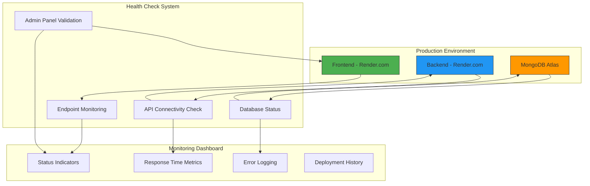
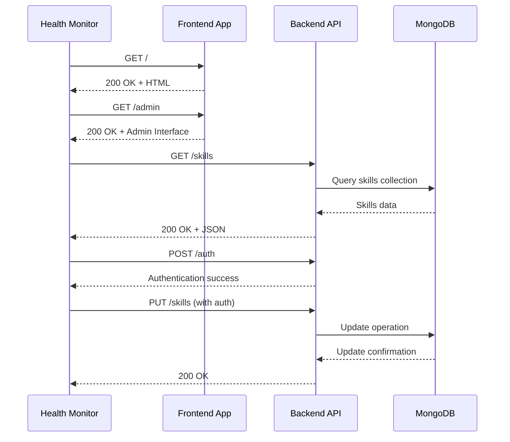

# Deployment Success Check - Design Document

## Overview

This document outlines the design and implementation strategy for monitoring and validating the successful deployment of the Mahidhar Portfolio website. The system ensures that both frontend and backend services are operational and accessible after deployment, with specific focus on the admin panel functionality at https://portfoliomahidhar.onrender.com/admin.

## Architecture

### System Components

The deployment success check system operates across three primary deployment environments:



### Deployment Architecture

| Component | Production URL | Status |
|-----------|---------------|---------|
| Frontend Application | https://portfoliomahidhar.onrender.com | ✅ Active |
| Admin Panel | https://portfoliomahidhar.onrender.com/admin | ✅ Functional |
| Backend API | https://portfoliomahidhar-backend.onrender.com | ✅ Active |
| Database | MongoDB Atlas | ✅ Connected |

## Health Check Framework

### 1. Frontend Application Monitoring

**Primary Endpoints**
- **Home Page**: `GET /` - Validates main portfolio landing page
- **Admin Panel**: `GET /admin` - Confirms admin interface accessibility
- **Static Assets**: Validates CSS, JS bundle loading
- **Component Rendering**: Ensures React components mount successfully

**Validation Criteria**
- HTTP response code 200
- Page load time < 3 seconds
- Critical components render without errors
- Navigation routing functions correctly

### 2. Backend API Health Checks

**Core API Endpoints**
```
GET /skills          - Portfolio skills data
GET /projects        - Project showcase data  
GET /experiences     - Professional experience data
GET /certifications  - Certifications data
GET /contact-info    - Contact information
GET /about          - About section data
```

**Admin API Endpoints**
```
PUT /skills          - Update skills (requires auth)
PUT /projects        - Update projects (requires auth)
PUT /experiences     - Update experience (requires auth)
PUT /certifications  - Update certifications (requires auth)
PUT /contact-info    - Update contact info (requires auth)
PUT /about          - Update about section (requires auth)
POST /upload        - Image upload (requires auth)
```

### 3. Authentication System Validation

**Admin Access Control**
- Bearer token validation: `Authorization: Bearer mahi@123`
- Login form functionality verification
- Protected route access confirmation
- Session persistence testing

**Security Verification**
- CORS configuration validation
- Unauthorized access blocking
- Input sanitization testing

### 4. Database Connectivity Monitoring

**MongoDB Connection Status**
- Connection string validation
- Database query response times
- Document CRUD operations testing
- Error handling verification

**Data Integrity Checks**
- Schema validation for all models
- Required field presence verification
- Data relationship consistency

## Monitoring Implementation

### Automated Health Checks



### Performance Metrics

**Response Time Targets**
- Frontend page load: < 2 seconds
- API endpoint response: < 500ms
- Database queries: < 200ms
- Image upload: < 5 seconds

**Availability Requirements**
- Uptime target: 99.5%
- Maximum downtime per month: 3.6 hours
- Recovery time objective: < 15 minutes

### Error Detection and Alerting

**Critical Failure Conditions**
- Frontend application not loading (500/404 errors)
- Admin panel authentication failure
- Backend API unavailable
- Database connection timeout
- CORS policy violations

**Alert Mechanisms**
- Email notifications for critical failures
- Slack integration for real-time alerts
- Dashboard status indicators
- Automated incident logging

## Deployment Validation Process

### Pre-deployment Checklist

1. **Environment Configuration**
   - [ ] Production URLs configured correctly
   - [ ] Environment variables set
   - [ ] Database connections verified
   - [ ] CORS settings updated

2. **Build Verification**
   - [ ] Frontend build successful
   - [ ] Backend dependencies installed
   - [ ] No TypeScript compilation errors
   - [ ] Asset optimization completed

3. **Security Validation**
   - [ ] Authentication tokens updated
   - [ ] HTTPS certificates valid
   - [ ] API endpoints secured
   - [ ] Admin access restricted

### Post-deployment Verification

1. **Immediate Checks** (0-5 minutes after deployment)
   - Frontend accessibility test
   - Admin panel login verification
   - Backend API connectivity
   - Database operation validation

2. **Functional Testing** (5-15 minutes)
   - Complete user journey testing
   - Admin content management workflow
   - Image upload functionality
   - Form submissions processing

3. **Performance Validation** (15-30 minutes)
   - Page load speed analysis
   - API response time measurement
   - Database query optimization
   - Resource utilization monitoring

## Testing Strategy

### Automated Test Suite

**Frontend Testing**
- Component rendering tests
- Route navigation validation  
- Admin authentication flow
- Form submission functionality
- Responsive design verification

**Backend Testing**
- API endpoint availability
- Authentication middleware
- Database CRUD operations
- File upload processing
- Error handling scenarios

**Integration Testing**
- End-to-end user workflows
- Admin panel content management
- Cross-browser compatibility
- Mobile responsiveness
- Performance benchmarking

### Manual Verification Steps

1. **Portfolio Navigation**
   - Access home page: https://portfoliomahidhar.onrender.com
   - Navigate through all sections (About, Skills, Projects, Experience, Contact)
   - Test dark mode toggle functionality
   - Verify responsive design on mobile devices

2. **Admin Panel Operations**
   - Access admin panel: https://portfoliomahidhar.onrender.com/admin
   - Login with credentials
   - Test each admin section (Skills, Projects, Experience, Certifications, Contact)
   - Upload and manage images
   - Save and verify content updates

3. **API Functionality**
   - Test all GET endpoints for data retrieval
   - Verify PUT endpoints with authentication
   - Test image upload functionality
   - Validate error handling for invalid requests

## Rollback Strategy

### Failure Detection Triggers

- Frontend application returns 500/404 errors consistently
- Admin panel authentication completely fails
- Backend API becomes unresponsive
- Database connection failures exceed 50%
- Critical functionality breaking errors

### Rollback Procedure

1. **Immediate Response** (0-5 minutes)
   - Activate previous stable deployment
   - Redirect traffic to backup instance if available
   - Disable failing features temporarily

2. **Investigation Phase** (5-30 minutes)
   - Analyze deployment logs
   - Identify root cause of failure
   - Assess data integrity impact
   - Document incident details

3. **Recovery Actions** (30+ minutes)
   - Apply hotfixes if possible
   - Complete rollback to previous version
   - Verify system functionality
   - Communicate status to stakeholders

## Configuration Management

### Environment Variables

**Frontend Configuration**
```javascript
// Production API base URL
const API_BASE = 'https://portfoliomahidhar-backend.onrender.com';

// Authentication credentials
const ADMIN_PASSWORD = 'Mahidhar';
```

**Backend Configuration**
```javascript
// Server configuration
const PORT = process.env.PORT || 4000;
const MONGODB_URI = process.env.MONGODB_URI;

// Authentication
const ADMIN_TOKEN = 'mahi@123';

// CORS settings
const corsOrigins = ['https://portfoliomahidhar.onrender.com'];
```

### Deployment URLs

| Service | URL | Purpose |
|---------|-----|---------|
| Frontend | https://portfoliomahidhar.onrender.com | Main portfolio website |
| Admin Panel | https://portfoliomahidhar.onrender.com/admin | Content management |
| Backend API | https://portfoliomahidhar-backend.onrender.com | REST API service |
| File Uploads | https://portfoliomahidhar-backend.onrender.com/uploads/ | Static file serving |