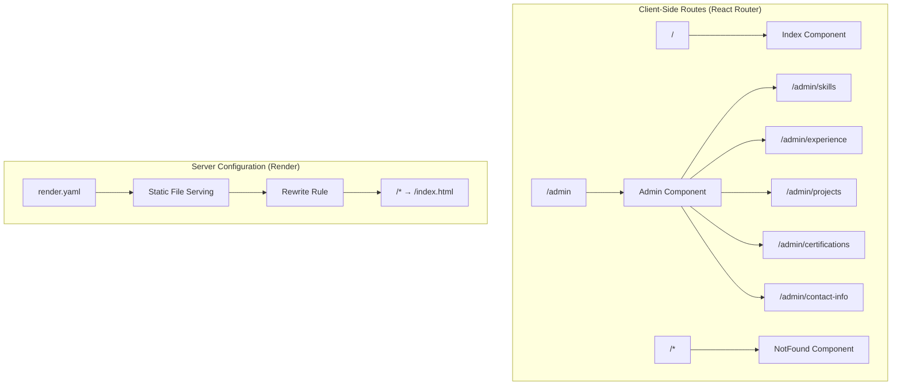

# SPA Routing 404 Fix Design

## Overview

This design addresses the 404 error occurring when accessing the admin panel at `/admin` route in the portfolio application deployed on Render. The issue stems from server-side routing configuration that doesn't properly handle Single Page Application (SPA) client-side routing.

## Problem Analysis

### Current Issue
- Frontend URL: https://portfoliomahidhar.onrender.com (working)
- Backend URL: https://portfoliomahidhar-backend.onrender.com (working)
- Admin Panel: https://portfoliomahidhar.onrender.com/admin (404 error)

### Root Cause
The 404 error occurs because when users navigate directly to `/admin` or refresh the page, the server attempts to serve a physical file at that path instead of serving the `index.html` file that contains the React application.

### Technical Context
- **Frontend Framework**: React with React Router (BrowserRouter)
- **Deployment Platform**: Render (static hosting)
- **Current Routing**: Client-side routing with nested admin routes
- **Build Output**: Static files in `frontend/dist/` directory

## Architecture Analysis

### Current Routing Configuration



### Current render.yaml Configuration
The existing configuration includes a rewrite rule but may need verification:

```yaml
routes:
  - type: rewrite
    source: /*
    destination: /index.html
```

## Solution Design

### Verification and Enhancement Strategy

#### 1. Server Configuration Validation
Ensure the Render deployment properly implements SPA routing by:
- Verifying the rewrite rule syntax
- Confirming static file serving configuration
- Validating build output structure

#### 2. Enhanced SPA Configuration

```yaml
services:
  - type: web
    name: portfoliomahidhar-frontend
    env: static
    buildCommand: cd frontend && npm install && npm run build
    staticPublishPath: frontend/dist
    routes:
      - type: rewrite
        source: "/((?!api|assets|favicon|robots|sitemap).*)"
        destination: /index.html
    headers:
      - key: Cache-Control
        value: public, max-age=31536000, immutable
        path: /assets/*
      - key: Cache-Control  
        value: public, max-age=0, must-revalidate
        path: /
      - key: X-Content-Type-Options
        value: nosniff
      - key: X-Frame-Options
        value: DENY
```

#### 3. Fallback Configuration Options

**Option A: Simple Catch-All**
```yaml
routes:
  - type: rewrite
    source: /*
    destination: /index.html
```

**Option B: Exclude Static Assets**
```yaml
routes:
  - type: redirect
    source: /admin
    destination: /admin/
    status: 301
  - type: rewrite
    source: /((?!assets|favicon.ico|robots.txt).*)
    destination: /index.html
```

### Build Verification Process

#### 1. Build Output Structure Validation
Ensure the build process generates the correct structure:

```
frontend/dist/
├── index.html          # Main entry point
├── assets/
│   ├── index-[hash].js # Main application bundle
│   ├── index-[hash].css # Styles
│   └── [other assets]
├── favicon.ico
└── robots.txt
```

#### 2. HTML Base Configuration
Verify the `index.html` contains proper base configuration:

```html
<base href="/" />
```

#### 3. Router Configuration Verification
Confirm React Router uses `BrowserRouter` (not `HashRouter`):

```tsx
<BrowserRouter>
  <Routes>
    <Route path="/" element={<Index />} />
    <Route path="/admin" element={<Admin />}>
      {/* Nested routes */}
    </Route>
  </Routes>
</BrowserRouter>
```

## Implementation Plan

### Phase 1: Diagnosis
1. **Verify Current Configuration**
   - Check if rewrite rule is correctly applied
   - Validate build output structure
   - Test direct file access patterns

2. **Identify Specific Issue**
   - Confirm whether it's a server config or build issue
   - Check if static assets are served correctly
   - Verify routing behavior for different paths

### Phase 2: Configuration Fix
1. **Update render.yaml** (if needed)
   - Apply enhanced rewrite rules
   - Configure proper caching headers
   - Add asset-specific routing

2. **Validate Frontend Configuration**
   - Ensure proper base href in index.html
   - Verify BrowserRouter implementation
   - Check for any hardcoded paths

### Phase 3: Testing & Validation
1. **Deployment Testing**
   - Test direct navigation to `/admin`
   - Verify page refresh functionality
   - Test nested admin routes
   - Validate asset loading

2. **Cross-browser Validation**
   - Test in multiple browsers
   - Verify mobile compatibility
   - Check performance impact

## Testing Strategy

### Test Cases

| Test Case | Expected Behavior | Validation Method |
|-----------|------------------|-------------------|
| Direct `/admin` access | Load admin dashboard | URL navigation |
| Page refresh on `/admin/skills` | Maintain current page | Browser refresh |
| Browser back/forward | Correct navigation | Browser controls |
| Deep link sharing | Load correct page | External link access |
| Asset loading | All resources load | Network panel check |

### Monitoring Points
- Response status codes (should be 200, not 404)
- Page load performance
- Asset delivery efficiency
- User experience consistency

## Risk Mitigation

### Potential Issues
1. **Cache Invalidation**: Old cached rules might persist
2. **Asset Conflicts**: Static assets might be affected by rewrite rules
3. **SEO Impact**: Ensure meta tags and routing don't break SEO

### Mitigation Strategies
1. **Deployment Verification**: Test immediately after deployment
2. **Rollback Plan**: Keep previous working configuration accessible
3. **Gradual Testing**: Test individual routes before full validation

## Success Criteria

### Primary Goals
- ✅ `/admin` route loads without 404 error
- ✅ Direct navigation to admin sub-routes works
- ✅ Page refresh maintains current route
- ✅ Static assets load correctly

### Performance Targets
- Page load time remains under 3 seconds
- Asset delivery maintains current performance
- No increase in server errors

### User Experience
- Seamless navigation between routes
- Consistent behavior across browsers
- Proper error handling for invalid routes