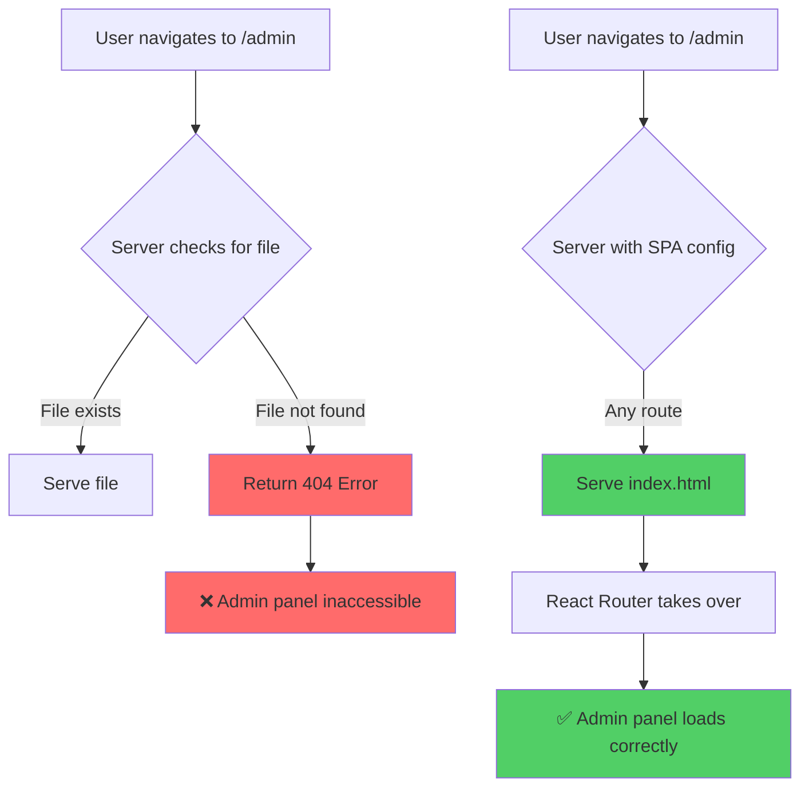
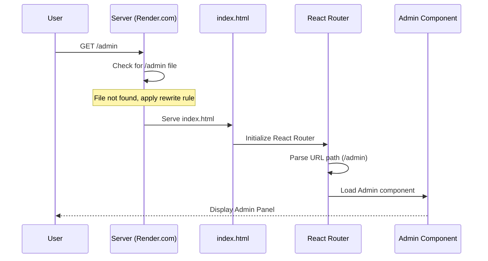

# SPA Admin Panel 404 Error Fix - Design Document

## Overview

The portfolio website is experiencing a 404 error when accessing the admin panel at `/admin` after deployment. This is a common issue with Single Page Applications (SPAs) that use client-side routing. The server needs to be configured to serve the main `index.html` file for all non-API routes to allow React Router to handle navigation properly.

## Problem Analysis

### Current Issue
- **Error**: 404 Not Found when accessing `https://portfoliomahidhar.onrender.com/admin`
- **Root Cause**: Server-side routing configuration not properly handling SPA client-side routes
- **Impact**: Admin panel is inaccessible, preventing content management functionality

### Technical Context
The application uses:
- **Frontend**: React with React Router v6 for client-side routing
- **Routing Configuration**: BrowserRouter with routes for `/`, `/admin`, and nested admin routes
- **Deployment**: Render.com static hosting with existing `render.yaml` configuration



## Architecture

### Current Routing Setup
```typescript
// App.tsx - React Router Configuration
<BrowserRouter>
  <Routes>
    <Route path="/" element={<Index />} />
    <Route path="/admin" element={<Admin />}>
      <Route path="skills" element={<SkillsAdmin />} />
      <Route path="experience" element={<ExperienceAdmin />} />
      <Route path="projects" element={<ProjectsAdmin />} />
      <Route path="certifications" element={<CertificationsAdmin />} />
      <Route path="contact-info" element={<ContactAdmin />} />
    </Route>
    <Route path="*" element={<NotFound />} />
  </Routes>
</BrowserRouter>
```

### Deployment Configuration Analysis
Current `render.yaml` configuration:
```yaml
services:
  - type: web
    name: portfoliomahidhar-frontend
    env: static
    buildCommand: cd frontend && npm install && npm run build
    staticPublishPath: frontend/dist
    routes:
      - type: rewrite
        source: /*
        destination: /index.html
```

## Solution Design

### SPA Routing Configuration Fix

The current `render.yaml` already contains the correct rewrite rule, but there may be caching or deployment issues. The solution involves:

1. **Verify Render.com Configuration**: Ensure the rewrite rule is properly applied
2. **Add Backup Configuration Files**: Include additional SPA routing configurations
3. **Update Build Process**: Ensure proper static file generation

### Implementation Strategy

#### 1. Render.com Configuration Verification
```yaml
# render.yaml - Enhanced configuration
services:
  - type: web
    name: portfoliomahidhar-frontend
    env: static
    buildCommand: cd frontend && npm install && npm run build
    staticPublishPath: frontend/dist
    routes:
      - type: rewrite
        source: /*
        destination: /index.html
    headers:
      - key: Cache-Control
        value: public, max-age=0, must-revalidate
```

#### 2. Backup SPA Configuration Files
Create additional configuration files for different hosting scenarios:

**_redirects file for Netlify/Render compatibility:**
```
/*    /index.html   200
```

**.htaccess for Apache servers:**
```apache
<IfModule mod_rewrite.c>
  RewriteEngine On
  RewriteBase /
  RewriteRule ^index\.html$ - [L]
  RewriteCond %{REQUEST_FILENAME} !-f
  RewriteCond %{REQUEST_FILENAME} !-d
  RewriteRule . /index.html [L]
</IfModule>
```

#### 3. Vite Build Configuration Enhancement
```typescript
// vite.config.ts - Ensure proper SPA build
import { defineConfig } from 'vite'
import react from '@vitejs/plugin-react'
import path from 'path'

export default defineConfig({
  plugins: [react()],
  resolve: {
    alias: {
      "@": path.resolve(__dirname, "./src"),
    },
  },
  build: {
    outDir: 'dist',
    assetsDir: 'assets',
    rollupOptions: {
      output: {
        manualChunks: undefined,
      },
    },
  },
})
```

### Component Interaction Flow



### Deployment Verification Steps

1. **Build Verification**: Ensure `frontend/dist` contains proper static files
2. **Route Testing**: Test all admin routes after deployment
3. **Cache Invalidation**: Clear Render.com cache if needed
4. **Fallback Configuration**: Verify backup configuration files are in place

## Testing Strategy

### Manual Testing Checklist
- [ ] Direct navigation to `/admin` works
- [ ] Navigation to nested admin routes works (`/admin/skills`, `/admin/projects`, etc.)
- [ ] Browser refresh on admin pages doesn't return 404
- [ ] Back/forward navigation works correctly
- [ ] Deep linking to admin URLs works

### Automated Testing Considerations
```typescript
// Example test for routing
describe('Admin Panel Routing', () => {
  test('should render admin panel on /admin route', () => {
    render(
      <MemoryRouter initialEntries={['/admin']}>
        <App />
      </MemoryRouter>
    );
    expect(screen.getByText('Admin Panel')).toBeInTheDocument();
  });
});
```

## Monitoring and Troubleshooting

### Common Issues and Solutions

| Issue | Cause | Solution |
|-------|--------|----------|
| 404 on direct navigation | Missing SPA rewrite rule | Add/verify rewrite configuration |
| Admin panel loads but sub-routes fail | Incorrect nested routing setup | Check React Router configuration |
| Works locally but fails in production | Build configuration mismatch | Verify Vite build settings |
| Intermittent 404 errors | Caching issues | Implement cache-busting headers |

### Debugging Steps
1. Check Render.com deployment logs
2. Verify `dist` folder contents after build
3. Test routing configuration locally
4. Inspect network requests in browser DevTools
5. Validate React Router setup

## Performance Considerations

### Optimization Strategies
- Implement proper caching headers for static assets
- Use code splitting for admin routes to reduce initial bundle size
- Lazy load admin components to improve performance

```typescript
// Lazy loading example for admin routes
const Admin = lazy(() => import('./pages/Admin'));
const SkillsAdmin = lazy(() => import('./pages/admin/SkillsAdmin'));

// Wrap with Suspense
<Suspense fallback={<div>Loading...</div>}>
  <Route path="/admin" element={<Admin />}>
    <Route path="skills" element={<SkillsAdmin />} />
  </Route>
</Suspense>
```

## Security Considerations

### Admin Panel Access Control
- Ensure admin authentication is properly implemented
- Consider adding additional security headers
- Implement proper session management for admin users

### Configuration Security
- Avoid exposing sensitive configuration in client-side code
- Use environment variables for API endpoints
- Implement proper CORS configuration

## Implementation Timeline

### Phase 1: Immediate Fix (1-2 hours)
1. Verify current `render.yaml` configuration
2. Add backup configuration files (`_redirects`, `.htaccess`)
3. Redeploy application
4. Test admin panel access

### Phase 2: Enhancement (2-4 hours)
1. Implement proper caching headers
2. Add automated tests for routing
3. Optimize build configuration
4. Document troubleshooting procedures

### Phase 3: Monitoring (Ongoing)
1. Set up monitoring for 404 errors
2. Implement error tracking
3. Regular testing of admin functionality
4. Performance monitoring        destination: /index.html
```

## Solution Design

### SPA Routing Configuration Fix

The current `render.yaml` already contains the correct rewrite rule, but there may be caching or deployment issues. The solution involves:

1. **Verify Render.com Configuration**: Ensure the rewrite rule is properly applied
2. **Add Backup Configuration Files**: Include additional SPA routing configurations
3. **Update Build Process**: Ensure proper static file generation

### Implementation Strategy

#### 1. Render.com Configuration Verification
```yaml
# render.yaml - Enhanced configuration
services:
  - type: web
    name: portfoliomahidhar-frontend
    env: static
    buildCommand: cd frontend && npm install && npm run build
    staticPublishPath: frontend/dist
    routes:
      - type: rewrite
        source: /*
        destination: /index.html
    headers:
      - key: Cache-Control
        value: public, max-age=0, must-revalidate
```

#### 2. Backup SPA Configuration Files
Create additional configuration files for different hosting scenarios:

**_redirects file for Netlify/Render compatibility:**
```
/*    /index.html   200
```

**.htaccess for Apache servers:**
```apache
<IfModule mod_rewrite.c>
  RewriteEngine On
  RewriteBase /
  RewriteRule ^index\.html$ - [L]
  RewriteCond %{REQUEST_FILENAME} !-f
  RewriteCond %{REQUEST_FILENAME} !-d
  RewriteRule . /index.html [L]
</IfModule>
```

#### 3. Vite Build Configuration Enhancement
```typescript
// vite.config.ts - Ensure proper SPA build
import { defineConfig } from 'vite'
import react from '@vitejs/plugin-react'
import path from 'path'

export default defineConfig({
  plugins: [react()],
  resolve: {
    alias: {
      "@": path.resolve(__dirname, "./src"),
    },
  },
  build: {
    outDir: 'dist',
    assetsDir: 'assets',
    rollupOptions: {
      output: {
        manualChunks: undefined,
      },
    },
  },
})
```

### Component Interaction Flow


### Deployment Verification Steps

1. **Build Verification**: Ensure `frontend/dist` contains proper static files
2. **Route Testing**: Test all admin routes after deployment
3. **Cache Invalidation**: Clear Render.com cache if needed
4. **Fallback Configuration**: Verify backup configuration files are in place

## Testing Strategy

### Manual Testing Checklist
- [ ] Direct navigation to `/admin` works
- [ ] Navigation to nested admin routes works (`/admin/skills`, `/admin/projects`, etc.)
- [ ] Browser refresh on admin pages doesn't return 404
- [ ] Back/forward navigation works correctly
- [ ] Deep linking to admin URLs works

### Automated Testing Considerations
```typescript
// Example test for routing
describe('Admin Panel Routing', () => {
  test('should render admin panel on /admin route', () => {
    render(
      <MemoryRouter initialEntries={['/admin']}>
        <App />
      </MemoryRouter>
    );
    expect(screen.getByText('Admin Panel')).toBeInTheDocument();
  });
});
```

## Monitoring and Troubleshooting

### Common Issues and Solutions

| Issue | Cause | Solution |
|-------|--------|----------|
| 404 on direct navigation | Missing SPA rewrite rule | Add/verify rewrite configuration |
| Admin panel loads but sub-routes fail | Incorrect nested routing setup | Check React Router configuration |
| Works locally but fails in production | Build configuration mismatch | Verify Vite build settings |
| Intermittent 404 errors | Caching issues | Implement cache-busting headers |

### Debugging Steps
1. Check Render.com deployment logs
2. Verify `dist` folder contents after build
3. Test routing configuration locally
4. Inspect network requests in browser DevTools
5. Validate React Router setup

## Performance Considerations

### Optimization Strategies
- Implement proper caching headers for static assets
- Use code splitting for admin routes to reduce initial bundle size
- Lazy load admin components to improve performance

```typescript
// Lazy loading example for admin routes
const Admin = lazy(() => import('./pages/Admin'));
const SkillsAdmin = lazy(() => import('./pages/admin/SkillsAdmin'));

// Wrap with Suspense
<Suspense fallback={<div>Loading...</div>}>
  <Route path="/admin" element={<Admin />}>
    <Route path="skills" element={<SkillsAdmin />} />
  </Route>
</Suspense>
```

## Security Considerations

### Admin Panel Access Control
- Ensure admin authentication is properly implemented
- Consider adding additional security headers
- Implement proper session management for admin users

### Configuration Security
- Avoid exposing sensitive configuration in client-side code
- Use environment variables for API endpoints
- Implement proper CORS configuration

## Implementation Timeline

### Phase 1: Immediate Fix (1-2 hours)
1. Verify current `render.yaml` configuration
2. Add backup configuration files (`_redirects`, `.htaccess`)
3. Redeploy application
4. Test admin panel access

### Phase 2: Enhancement (2-4 hours)
1. Implement proper caching headers
2. Add automated tests for routing
3. Optimize build configuration
4. Document troubleshooting procedures

### Phase 3: Monitoring (Ongoing)
1. Set up monitoring for 404 errors
2. Implement error tracking
3. Regular testing of admin functionality
4. Performance monitoring


